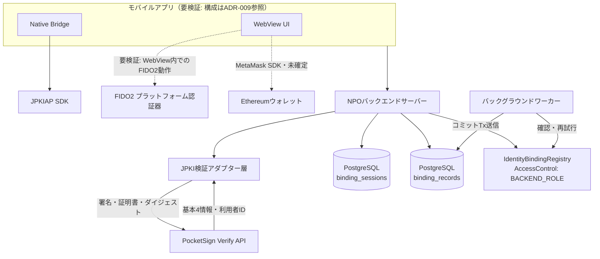
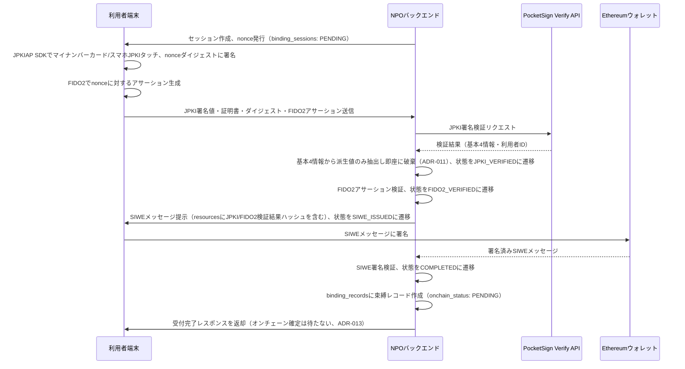
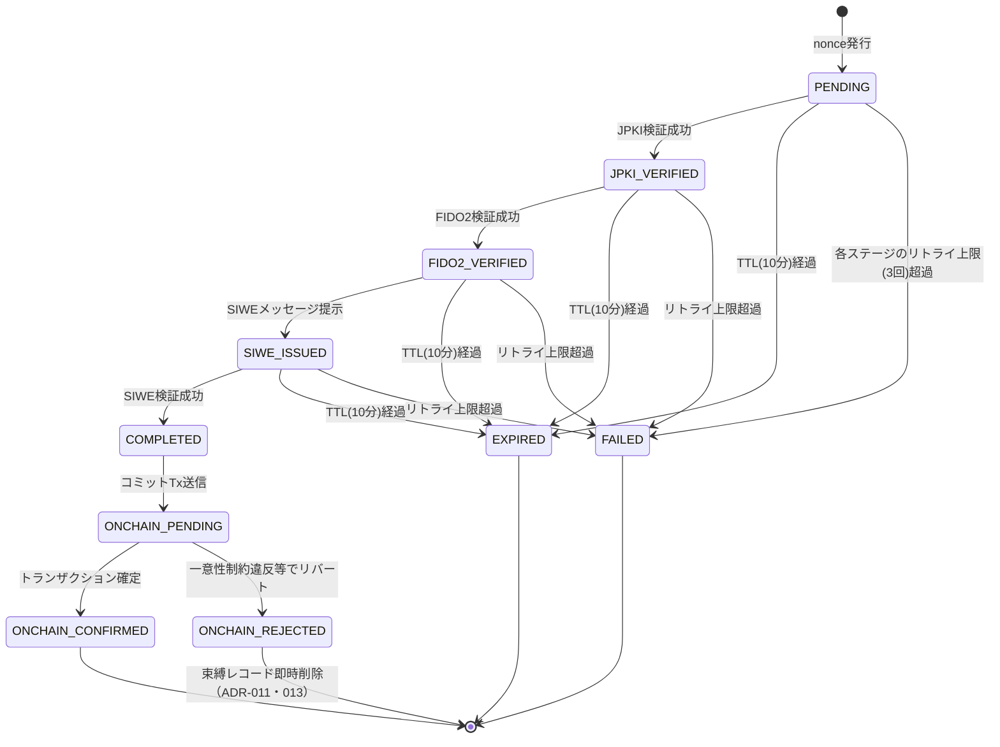

# 鍵束縛プロトコル仕様書
## JPKI × FIDO2 × Ethereum 公開鍵束縛による音楽Web3ガバナンス実験基盤

- バージョン: v0.3（ADR-001〜013の内容を反映し、セッション管理・異常系・個人情報・シークレット管理を詳細化）
- 対象: 100人規模プロトタイプ実験
- ステータス: 実装前レビュー段階
- 準拠ADR: ADR-001〜ADR-013（`adr-key-binding-protocol.md`）

---

## 1. 目的

音楽サブスクリプションをスマートコントラクトベース化し、資金配分等のガバナンスをプラットフォーマ中心から音楽クリエイターと利用者中心に移行するシステムにおいて、ガバナンス参加者の一意性（Sybil耐性）と本人性を、以下3つの鍵の暗号学的束縛によって担保する。

- **JPKI公開鍵**: 公的個人認証サービスによる本人性の担保（住民基本台帳ベース）
- **FIDO2 Passkey公開鍵**: デバイスに紐づく継続認証
- **Ethereumウォレット公開鍵**: オンチェーンでの行為主体性

本仕様は、VC（Verifiable Credential）発行を将来のスコープとし（ADR-005）、まず3鍵の束縛プロトコル自体の実装を対象とする。

## 2. 用語

| 用語 | 定義 |
|---|---|
| SP事業者 | 公的個人認証法上、電子証明書の有効性確認をPF事業者に委託して公的個人認証サービスを利用する事業者。本プロジェクトのNPO法人がこれに該当する（ADR-001） |
| PF事業者 | 主務大臣認定を受け、署名検証業務を行う事業者。本仕様ではPocketSign Verifyを採用（ADR-002） |
| 束縛セッション | nonce発行から束縛レコード生成（またはセッション失敗・失効）までの一連の処理単位。`binding_sessions`テーブルで管理する（ADR-010） |
| 束縛レコード | 束縛セッションが成功裏に完了した結果として生成される、3つの鍵の検証結果の恒久的な記録。`binding_records`テーブルで管理する（ADR-011） |
| SIWE | Sign-In with Ethereum（ERC-4361）。Ethereumアカウントによるログイン・署名の標準規格（ADR-004） |

## 3. 採用標準規格

| 対象 | 規格・方式 | 備考 |
|---|---|---|
| JPKI | 公的個人認証法に基づく署名用電子証明書（RSA2048 / ECDSA P-256） | PocketSign Verify API経由でのみ検証可能。SP事業者側での自前検証は不可（ADR-002） |
| JPKI連携 | PocketSign Verify API / JPKIAP SDK | スマホNFCカード読み取り、および「スマホJPKI」（Android/iOS）に対応 |
| ダイジェストハッシュ | CRYPTREC電子政府推奨暗号リスト準拠（SHA-256） | PocketSign Verify APIの制約による |
| FIDO2 | W3C WebAuthn Level 2 / CTAP2、署名アルゴリズムES256必須 | Attestationは`none`（プライバシー配慮）（ADR-003） |
| Ethereum | EIP-4361 (SIWE) | `resources`フィールドにJPKI・FIDO2検証結果への参照を埋め込む（ADR-004） |

## 4. システム構成

### 4.1 全体構成



- SP事業者（本NPO）は署名検証設備を自ら保有せず、PocketSign Verify APIへの委託によって公的個人認証サービスを利用する（ADR-001・ADR-002）。JPKI検証はNPOが管理するバックエンドサーバーからのみ呼び出し、APIトークンをクライアントに含めない。
- バックエンドとPocketSign Verify APIの間には**JPKI検証アダプター層**を設け、PocketSign固有のレスポンス形式に他の層を直接依存させない（ADR-008）。将来PF事業者を切り替える場合は、このアダプターの実装差し替えのみで対応する。
- **モバイルアプリのWebView中心構成は、WebView内でのFIDO2（プラットフォーム認証器）動作の実機検証結果が出るまで確定しない（ADR-009）。** 動作しない場合、FIDO2もNative Bridge経由でCredential Manager API / Authentication Servicesを直接呼び出す構成に切り替える。
- ウォレット接続方式（MetaMask SDK等）も同様に、WebView構成の結論を待って確定する（ADR-009）。
- `IdentityBindingRegistry`は`Ownable`を使わず**AccessControlに一本化**し、`bind()`を呼べるのは`BACKEND_ROLE`を持つアドレスのみとする。`ReentrancyGuard`は外部呼び出しを伴わない設計のため現時点では導入しない（ADR-009）。

### 4.2 バックエンドのフレームワーク・ライブラリ選定

Webフレームワーク（Fastify/Express）、コントラクト呼び出しライブラリ（ethers@6/viem）は、性能や抽象的な型安全性の優劣ではなく、**チーム習熟度と実装済みコードとの入れ替えコスト**を判断基準として決定する（ADR-009）。本書執筆時点で最終選定は未確定。

## 5. 束縛セレモニーのシーケンス（正常系）



各ステージの検証呼び出しはADR-013に基づき冪等に扱われ、ネットワーク再送による重複リクエストは直前の成功結果をキャッシュから返す。

## 6. セッション状態遷移とnonce管理

セッション状態は`binding_sessions`テーブル（PostgreSQL）で管理し、Redis等の追加インフラは導入しない（ADR-010）。



- **TTL**: nonce発行から10分。期限切れセッションへの検証要求は拒否する（ADR-010）。
- **単一使用性**: Postgresの条件付きUPDATE（`WHERE status = $expected AND expires_at > now()`）で原子的に保証する。分散ロックやRedisのアトミック操作は使用しない（ADR-010）。
- **期限切れ時は部分進捗を再利用しない**: nonceは3つの署名すべてで共有されているため、失効は全ステージの署名を無効化する。ユーザーは新しいセッションで最初からやり直す（ADR-013）。
- **クリーンアップ**: 期限切れセッションは1時間ごとのバッチ処理で`EXPIRED`へ遷移、または物理削除する（ADR-010）。

## 7. データモデル

### 7.1 `binding_sessions`（一時的セッション状態、ADR-010・013）

```json
{
  "session_id": "uuid",
  "nonce": "string",
  "status": "PENDING | JPKI_VERIFIED | FIDO2_VERIFIED | SIWE_ISSUED | COMPLETED | EXPIRED | FAILED",
  "retry_count_jpki": "integer (0-3)",
  "retry_count_fido2": "integer (0-3)",
  "retry_count_siwe": "integer (0-3)",
  "fido2_credential_id": "base64url, nullable",
  "eth_address": "0x..., nullable",
  "expires_at": "ISO8601 timestamp",
  "created_at": "ISO8601 timestamp",
  "updated_at": "ISO8601 timestamp"
}
```

基本4情報・JPKI証明書・署名値はこのテーブルにも一切書き込まない（ADR-011）。

### 7.2 `binding_records`（束縛レコード本体、ADR-011）

```json
{
  "record_id": "uuid",
  "session_id": "uuid (FK)",
  "jpki_provider": "pocketsign",
  "jpki_user_id_hash": "HMAC-SHA256(pepper, user_id) の16進表現",
  "fido2_credential_id": "base64url",
  "eth_address": "0x...",
  "onchain_tx_hash": "0x..., nullable",
  "onchain_status": "PENDING | CONFIRMED | REJECTED",
  "created_at": "ISO8601 timestamp",
  "deleted_at": "ISO8601 timestamp, nullable"
}
```

- `jpki_user_id_hash`は単純なSHA-256ではなく、**NPO固有の秘密のペッパーを用いたHMAC**で算出する。他のPocketSign利用サービスによるクロスサービス相関（名寄せ）を防ぐため（ADR-011）。
- `jpki_provider`フィールドにより、PF事業者切り替え時の新旧レコードの区別・再束縛判定に用いる（ADR-008）。
- `onchain_status`が`REJECTED`になったレコードは、削除請求を待たず即時に物理削除する（ADR-011・ADR-013）。

### 7.3 `audit_logs`（監査ログ、ADR-011）

```json
{
  "log_id": "uuid",
  "session_id": "uuid",
  "provider": "pocketsign",
  "result": "success | failure",
  "error_code": "string, nullable",
  "timestamp": "ISO8601 timestamp"
}
```

基本4情報・証明書の内容は含めない。保持期間は1年間、経過後は削除する（ADR-011）。

## 8. オンチェーンレジストリ

- `IdentityBindingRegistry`は**AccessControlに一本化**し、`bind()`を呼べるのは`BACKEND_ROLE`を持つアドレスのみとする。`Ownable`との併用は行わない（ADR-009）。
- `mapping(bytes32 => address) userIdHashToWallet` により、1人につき1ウォレットの束縛を強制する。
- `mapping(address => bytes32) walletToBindingHash` により、ガバナンスコントラクトから「このウォレットは検証済み束縛を持つか」を1回の参照で確認できるようにする。
- 生の個人情報・証明書はオンチェーンに置かない。コミットメントハッシュのみを記録する（ADR-006）。
- `ReentrancyGuard`は、`bind()`が外部コントラクト呼び出しを伴わないため現時点では導入しない。外部呼び出しを伴う機能が具体化した時点で再評価する（ADR-009）。
- 単位時間あたりの`bind()`呼び出し回数にレート制限を設け、署名鍵漏えい時の被害を時間的に限定する（ADR-012）。

## 9. 異常系の処理方針

正常系（第5節）だけでは実運用は成立しない。以下の異常系をADR-013に基づき実装する。

| 事象 | 挙動 |
|---|---|
| 各ステージの検証失敗 | 同一セッション内で最大3回まで再試行を許可。上限超過でセッションを`FAILED`とし、新しいセッションでのやり直しを要求する |
| セッションのTTL経過 | `EXPIRED`に遷移。部分進捗は再利用せず、全ステップを再実行する |
| 同一ステージへの重複リクエスト | 冪等に扱い、直前の成功結果をキャッシュから返す。PocketSign Verify APIの再課金・FIDO2検証の再実行は行わない |
| オンチェーンコミット未確定 | `binding_records.onchain_status = PENDING`のまま、バックグラウンドワーカーが確認・再試行する |
| オンチェーンコミットの恒久的失敗（一意性制約違反） | セッションを`FAILED`（理由: 重複識別）、`binding_records`を`onchain_status = REJECTED`とし即時削除する。同一人物による複数デバイスからの同時多重登録（レースコンディション）に対する最終防御線として機能する |
| セッション放棄（ユーザーが離脱） | TTL経過により自動的に`EXPIRED`。監査ログのメタデータ以外のデータは残らない |

## 10. 個人情報の取扱い

- **基本4情報（氏名・住所・生年月日・性別）・JPKI証明書・署名値は一切永続化しない。** DB・アプリケーションログ・インフラログのいずれにも書き込まず、PocketSign Verify APIへのリクエストスコープ内のメモリ上でのみ扱い、必要な派生値を算出した時点で即座に破棄する（ADR-011）。
- ログ出力ミドルウェアは、PocketSign APIとの通信内容（リクエスト・レスポンスボディ）を自動的にマスクする（ADR-011）。
- 監査ログは検証イベントのメタデータ（`session_id`・プロバイダ名・結果・タイムスタンプ・エラーコード）のみとし、1年間保持後に削除する（ADR-011）。
- `binding_records`はサービス提供期間中保持する。利用者からの削除請求があった場合、オフチェーンの当該レコードを削除する。**オンチェーンのコミットメントハッシュはブロックチェーンの不可逆性により削除できない**ため、この制約を同意取得時に明示する（ADR-011）。
- `jpki_user_id_hash`はNPO固有のペッパーを用いたHMACで算出し、クロスサービス相関を防止する（ADR-011）。ペッパーの管理方式は第11節を参照。

## 11. シークレット管理

本プロトコルが扱うシークレットは重要度が異なるため、一律の管理方式ではなく重要度に応じた対応を取る（ADR-012）。

| シークレット | 重要度 | 管理方式 |
|---|---|---|
| ブロックチェーン署名鍵（`BACKEND_ROLE`の秘密鍵） | 最高 | 環境変数管理＋ホットウォレット残高の最小化＋コントラクト側のレート制限（第8節） |
| PocketSign Verify APIトークン | 高 | 環境変数管理、クライアントには配布しない（ADR-002） |
| HMACペッパー（第7.2節） | 高 | 環境変数管理 |
| DB接続情報 | 中〜高 | 環境変数管理 |

100人規模のプロトタイプ段階では、クラウドのSecrets ManagerやHashiCorp Vaultは導入せず、デプロイ基盤の暗号化環境変数機能で管理する。以下のいずれかに該当した時点で、ブロックチェーン署名鍵のみをKMS等で管理するハイブリッド方式へ移行する（ADR-012）。

- サービスの収益事業化（ADR-008の本格運用移行と同じタイミング）
- `bind()`の呼び出し量・資金規模の拡大
- チーム規模の拡大によるアクセス権限者の増加
- インシデントの発生

## 12. 本格運用移行時の考慮事項

プロトタイプで確立した束縛プロトコルは、事業規模の拡大に対して層ごとに連続性の強さが異なる。

| 層 | 本格運用への連続性 |
|---|---|
| FIDO2 | 公開標準（WebAuthn）に基づき、事業規模・法人形態に非依存。設計変更ほぼ不要 |
| Ethereum / SIWE | 同様に公開標準ベースで規模非依存。マルチチェーン対応やアカウントアブストラクション（ERC-4337）の追加はあり得るが、束縛の骨格は不変 |
| ZK証明レイヤー（ADR-007） | 束縛レコードのスキーマが安定していれば、JPKI供給元に依存せず継続利用可能 |
| JPKI / PF事業者 | プロバイダの実装詳細に強く結合しており、連続性が最も弱い層 |

JPKI/PF事業者の層については、収益事業化に伴いPocketSign VerifyでのSP契約を継続するか、NPO関連の株式会社を設立してPF事業者化するかを再検討する可能性がある（ADR-001・ADR-002）。この際、以下を前提として設計する（ADR-008）。

- JPKI検証呼び出しはアダプター層の背後に隠し、他の層（FIDO2・SIWE・ZK）に影響を及ぼさない形でPF事業者を切り替えられるようにする。
- `jpki_user_id_hash`がプロバイダ間で可搬な識別子かどうかは未確認であり、切り替え時には**再束縛（re-binding）セレモニー**を正式な移行ステップとして想定する。
- 実装着手前に、PocketSignまたはJ-LISに対し、利用者ID生成ロジックのPF事業者間での可搬性を直接確認する。

## 13. セキュリティ・プライバシー考慮事項（一般）

- ダイジェストのハッシュ関数はCRYPTREC準拠のものに限定する（ADR-002）。
- SIWEメッセージの`domain`検証によりフィッシング・リプレイを防止する（ADR-004）。
- FIDO2のAttestationは`none`とし、デバイス識別情報の不要な収集を避ける（ADR-003）。
- 個人情報の取扱いの詳細は第10節、シークレット管理は第11節を参照。

## 14. 本仕様のスコープ外（今後の検討事項）

- VC（Verifiable Credential）形式への移行（ADR-005）
- 犯罪収益移転防止法・金融商品取引法（集団投資スキーム該当性）の整理
- NPOのPF事業者化の要否判断
- スマホJPKI非対応環境（古いOSバージョン等）でのフォールバック設計
- 再束縛セレモニーの具体的なUX・通知フロー設計（ADR-008）
- WebView内FIDO2の実機検証結果に基づくモバイルアーキテクチャの最終決定（ADR-009）
- TTL（10分）とリトライ上限（3回）の組み合わせが実際のユーザー行動に対して十分な余裕を持つかの検証
- オンチェーンコミットがリバートしたユーザーへのUI・サポート導線の設計（ADR-013）

## 15. 参考

- デジタル庁「公的個人認証サービス（JPKI）」
- PocketSign Verify API ドキュメント
- EIP-4361: Sign-In with Ethereum
- W3C WebAuthn Level 2
- `adr-key-binding-protocol.md`（ADR-001〜013）

## 16. 主体・権限・操作証拠の補足仕様 v0.1 {#evidence-design}

追加日：2026年9月7日。対応：[ADR-020](/adr#adr-020)・[ADR-021](/adr#adr-021)。仕様書v0.3の原設計に対する追加要件であり、以下の機能は未実装。原文のVC見送りはP0に限定し、次の検証段階に証拠基盤を追加する。法的な推定効の適用は未確認である。

### 16.1 主体と証明

主体IDはサービス内で安定した識別子とする。DID方式は未選定。身元の対応表は非公開とし、主体IDをウォレットアドレスやJPKI証明書の単純ハッシュから自動生成しない。主体と操作者が異なる法人・代理のケースは委任VCで表現する。

| VC | 必須の意味情報 |
| --- | --- |
| 本人確認VC | subject、確認方法・日時、provider、保証範囲、証拠参照、模倣フラグ |
| 鍵束縛VC | subject、FIDO2公開鍵とcredential識別情報、wallet、chain、登録文書hash、検証方式版 |
| 権利・委任VC | 権利者、操作者、作品ID・版、権利種別、許可操作、地域・期間、共同権利・再委任条件、根拠文書参照 |

共通項目はid、issuer、subject、発行・確認日時、有効期間、status参照、schema/policy版、署名。これは意味上の項目表であり、W3C準拠プロファイルそのものではない。署名方式・正規化・DID解決・状態確認を固定し、テストベクトルを用意してから相互運用を宣言する。

発行者台帳は、実在主体との対応、署名鍵の履歴、有効期間、証明可能な範囲、審査・失効方針を保持する。台帳を信頼する根拠も検証者に提示する。

### 16.2 登録文書と鍵変更

登録文書は「本サービスでこの鍵を自分の操作に用いる」という意思を示し、subject、rp_id/origin、FIDO2公開鍵hash、wallet/chain、nonce、期限、規約版を固定する。ADR-015のBindingIntentと同じデータを参照し、表示文書と署名対象の対応を保存する。

実JPKIが文書又はダイジェストに署名できる場合のみ、その事実を記録する。通常の本人確認応答しか得られない場合は、身元確認証拠とFIDO2・ウォレットによる登録同意を別証拠として保存する。PFの機能は模倣で検証済みと扱わない。

鍵の追加・変更・紛失復旧は別の操作とし、継続性確認、旧鍵の失効、新VC発行、本人通知、履歴を残す。新しい鍵が過去に署名したとは扱わない。

### 16.3 操作文書と二重承認

```text
OperationIntent =
 protocolVersion, operationId, subjectId,
 workId, workVersion, action, counterparty,
 termsHash, displayDocumentHash, credentialHashes,
 chainId, verifyingContract, functionAndArgumentsHash,
 wallet, nonce, issuedAt, expiresAt
```

1. サーバーは意味と表現を固定した操作文書を作り、対象・権限・契約条件を利用者に表示する。
2. OperationIntentのcanonical bytesとhashを確定する。正規化方式は実装前に固定し、hashだけでなく原文も証拠保存する。
3. WebAuthn challengeに、用途を区別する固定値、intentHash、ランダムchallengeを含める。署名・公開鍵・origin・rpIdHash・type・UV・challenge・所有セッションを検証する。
4. ウォレットには同じintentHashと実行先・nonce・期限を含むEIP-712署名を要求し、サーバーとコントラクトの解釈を一致させる。SIWEログインはこの承認を代替しない。
5. VC署名・発行者の権限・subject対応・期限・失効・作品別の操作範囲を確認する。VCを持っているだけでは認可しない。
6. 実行直前にも状態と有効期限を確認する。nonce消費を原子的に行い、実際の呼出先と引数が署名対象に一致する場合だけ実行する。再送は同じ操作IDで照合し、重複実行しない。

二つの鍵が同じ端末・同期基盤で管理され得るため、独立した二者承認や絶対的な否認防止とは称さない。初期検証はEOAに限定し、コントラクトウォレットは別の検証要件を定める。WebAuthnのオンチェーン直接検証は今回の必須条件ではなく、その部分を検証するNPOバックエンドへの信頼を明示する。

### 16.4 証拠パッケージ

パッケージには以下を含め、各ファイルのhash、形式・方式版、証拠の提供者をmanifestに記載する。

- 登録・操作文書の原文、署名対象bytes、表示内容の版。
- FIDO2 assertion一式・検証公開鍵、ウォレット署名・署名対象。
- 利用VC、発行者鍵の過去版、操作時点の状態証拠と取得時刻。
- PFの検証証跡又はNPOの証明。独立検証できる範囲を明示。
- NPOが署名した受付証、外部タイムスタンプ（採用後）、監査参照。
- 実行結果の別記録、transaction hash、実行先・引数、receiptと確定性確認情報。受付時点で実行完了とはしない。

状態情報が後から取得された場合は、その事実と証明可能な時間範囲を記録する。操作時点の失効を判断できないときは「不明」とする。状態情報の最大許容経過時間、緊急失効の反映時間、チェーン確定条件を運用開始前に固定する。

### 16.5 第三者検証

検証ツールは、運営者の画面表示に依存せずエクスポートされた証拠を検証する。検証者が受け入れる発行者・policyを指定できることを要件とする。

出力は「暗号学的整合性」「主体と鍵の対応根拠」「権限範囲」「過去時点の有効性」「承認と実行の一致」を別々に示し、成功・失敗・証拠不足／判断不能を区別する。「推定効あり」「著作権保有が法的に確定」といった自動判定はしない。タイムスタンプは本人意思や権利内容を保証しない。

### 16.6 保存・開示

通常ログに機微データを出力せず、証拠庫を分離して暗号化、最小権限、改変検出、アクセス監査を行う。公開チェーンにはVCや契約書の原文を置かない。コミットメントを公開する場合も相関リスクを評価する。

保存期限、法的保全、削除、開示対象、PF側の証拠取得可能期間、サービス終了後の取得手段は未確定。ADR-011の非保存方針と衝突する項目を解消し、専門家レビューと改訂を完了するまで実データを導入しない。削除後に検証できなくなる範囲も説明する。

### 16.7 実装段階と受入条件

P0の模倣APIは現状維持。追加段階では合成の本人確認VC・鍵束縛VC・権利VCを発行し、FIDO2とEOAの実署名、証拠出力、独立検証を試験する。証拠には `provider=mock / isMock=true / assurance=simulation-only` を伝播させ、実権利の操作先では拒否する。

必須試験：別人のVC混入、作品・相手方・引数差替え、署名再送、期限切れ、失効、無権限発行者、旧鍵・新鍵の取り違え、改変された原文、欠落証拠、結果不明、バックエンド再起動時の重複実行。過去時点を立証できない試験で、検証ツールが判断不能を返すことも確認する。

PF実接続、実権利操作、推定効の適用評価、独立タイムスタンプ事業者、保存期間は後工程。PF模倣の成功でこれらを完了扱いにしない。
